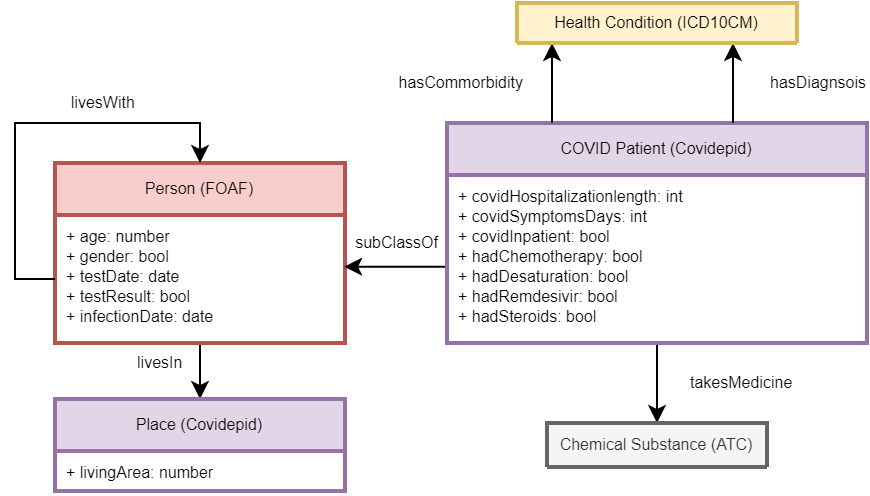

# Background

This repository contains the [*covidepid*](covidepid.owl) ontology along with four external ontologies that the [*covidepid*](covidepid.owl) ontology integrates into a single domain data model:

 1. [Anatomical Therapeutic Chemical Classification (ATC) by World Health Organization, v2021aa](https://bioportal.bioontology.org/ontologies/ATC)
 2. [International Classification of Diseases, Version 10 - Clinical Modification (ICD10CM) by World Health Organization, v2021aa](https://bioportal.bioontology.org/ontologies/ICD10CM)
 3. [*Friend of a Friend* (FOAF) by Dan Brickley and Libby Miller](http://xmlns.com/foaf/spec/)
 4. [*FOAF Relationship* - an extension of FOAF by Ian Davis](https://vocab.org/relationship/)

The four external ontologies are uploaded here in case they get removed from their original sources on the Internet. I do not claim rights to them and I want hereby to credit their authors as indicated in their coresponding entries in the list above.

# The [*covidepid*](covidepid.owl) ontology

The [*covidepid*](covidepid.owl) ontology is a domain data model used in the *Evaluation of the impact of the B.1.1.7 SARS-
COV-2 virus variant on epidemiology and clinical picture of COVID-19 in children* project (2021-2022, University of Warsaw, Medical University of Warsaw). It is subject to change and should be treated as a proof of concept.

For more information on the epidemiological study and the data model refer to my [master's thesis: Evaluation of the Linked Data approach to curation and processing of data in epidemiology](https://zenodo.org/record/5815012).

The image above depicts a part of the [covidepid](covidepid.owl) ontology that was relevant to my master's thesis. Each color depicts a different *domain*, each self-contained with a complex inner structure. Red color corresponds to social concepts, such as *Person* or the "*lives with*" relationship. Yellow color corresponds to the [ICD-10CM taxonomy](https://bioportal.bioontology.org/ontologies/ICD10CM) and (health conditions). Grey color corresponds to the [ATC taxonomy](https://bioportal.bioontology.org/ontologies/ATC) (pharmacology). Purple color is the core concept of the [*covidepid*](covidepid.owl) ontology that integrates those three domains into a single interdisciplinary data model.

# covidepid.owl license

[covidepid.owl](covidepid.owl) license: [GNU Public License 3](https://www.gnu.org/licenses/gpl-3.0.html). Copyright (C) 2021-2022 Jakub Jalowiec kuba.jal(at)gmail.com. For more information & citation refer to [this page](https://zenodo.org/record/5815012).